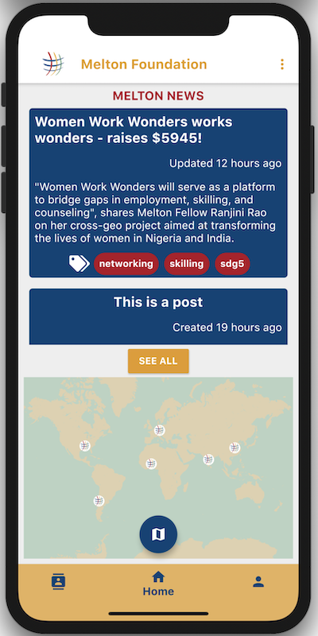
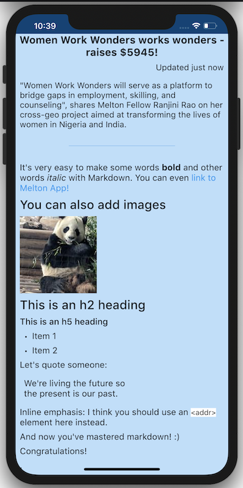

# Melton App

App by and for Melton Foundation Fellows - https://meltonfoundation.org/

Flutter app for iOS and Android with Google Maps markers, markdown preview, directory search with filters, simple online store.

Contributions are welcome :)
Please have a look at our GitHub Issues and [GETTING-STARTED.md](docs/GETTING-STARTED.md)

## Features

### View and edit your Profile
#### Social media links, contact info

### Home - Markdown articles and Custom Map

### Map - custom marker, view profile, shuffle city button

### Directory - search + filters
#### Search by name/email or filter by multiple criteria

### Posts - markdown articles
#### Posted from Django admin and sent via REST API

